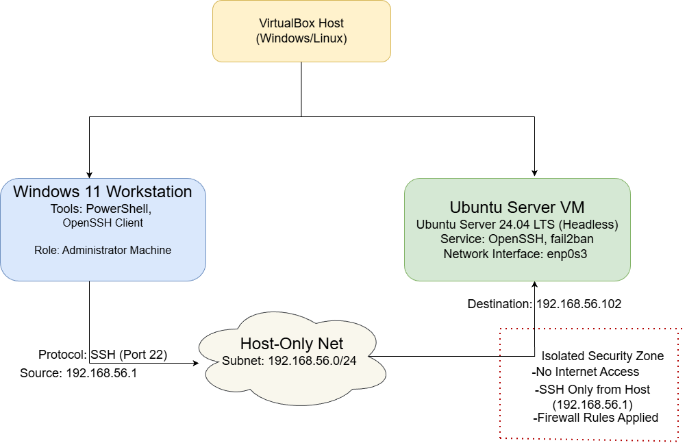

# Week 1 – System Planning and Distribution Selection

**Student Name:** Mehedi Hasan Rakib  
**Student ID:** A00022820  
**Module:** CMPN202 – Operating Systems  

## System Architecture Diagram

**Figure 1:** Dual-system architecture showing the Windows 11 workstation, VirtualBox hypervisor, host-only network, and headless Ubuntu Server 24.04 LTS used for SSH-based remote administration.

---

## System Architecture Explanation

This coursework uses a dual-system architecture that reflects professional server administration practices. A Windows 11 workstation acts as the administrator machine, while an Ubuntu Server virtual machine operates headless as the managed server. All system administration tasks are performed remotely using secure command-line access.

The systems communicate through a VirtualBox host-only network, which creates an isolated private subnet. This prevents the server from being exposed to external networks while still allowing secure communication between the workstation and the server.

Secure Shell (SSH) is used as the remote administration protocol. The workstation initiates encrypted SSH connections to the Ubuntu Server over port 22, ensuring confidentiality and integrity of management traffic.

---

## Distribution Selection Justification

Ubuntu Server 24.04 LTS was selected as the server operating system due to its stability, long-term support, and strong security features. As a Long Term Support (LTS) release, it receives extended security updates and maintenance, making it suitable for production-style environments and academic coursework.

Ubuntu Server is designed for headless operation, which aligns with the coursework requirement to manage the system entirely via the command-line interface using SSH. It also integrates well with core security tools such as OpenSSH, UFW, and AppArmor, which are required in later phases of the coursework.

Alternative distributions were evaluated. Debian offers excellent stability but slower access to newer features. Fedora Server provides newer software but lacks long-term stability. Rocky Linux is enterprise-oriented but introduces additional configuration complexity. Ubuntu Server offers the best balance of usability, security, documentation, and long-term reliability.

---

## Workstation Configuration Decision

A Windows 11 workstation was chosen as the administrator system due to its compatibility with VirtualBox and built-in support for SSH through PowerShell. This allows secure remote access to the Ubuntu Server without requiring third-party tools.

Using Windows as the workstation also provides a practical environment for documentation, GitHub Pages management, and coursework submission. Separating the workstation from the server mirrors real-world administration practices and reinforces secure remote system management.

---

## Network Configuration Documentation

The virtual machines are connected using a VirtualBox host-only network, providing a private and isolated communication channel.

- **Network Type:** Host-only network  
- **Subnet:** 192.168.56.0/24  
- **Workstation IP:** 192.168.56.1  
- **Ubuntu Server IP:** 192.168.56.102  
- **Server Network Interface:** enp0s3  

SSH communication follows this path:

**Windows Workstation → Host-only Network → Ubuntu Server (SSH port 22)**

This configuration limits access to the server and reduces the overall attack surface.

---

### CLI System Specification Evidence

Baseline system information was collected using standard Linux command-line tools to document the server configuration:

- `uname -a` — kernel version and system architecture  
- `free -h` — memory usage statistics  
- `df -h` — disk usage and file system layout  
- `ip addr` — network interface and IP configuration  
- `lsb_release -a` — operating system distribution and version  

These commands provide verifiable evidence of the system state and establish a baseline for later performance and security analysis.

---

## Weekly Reflection

This week focused on planning and design rather than implementation. Creating the system architecture improved my understanding of virtualisation, network isolation, and secure server administration. The distribution selection process highlighted the importance of balancing stability, security, and usability. This foundation will support the implementation of security controls and performance testing in later weeks.
